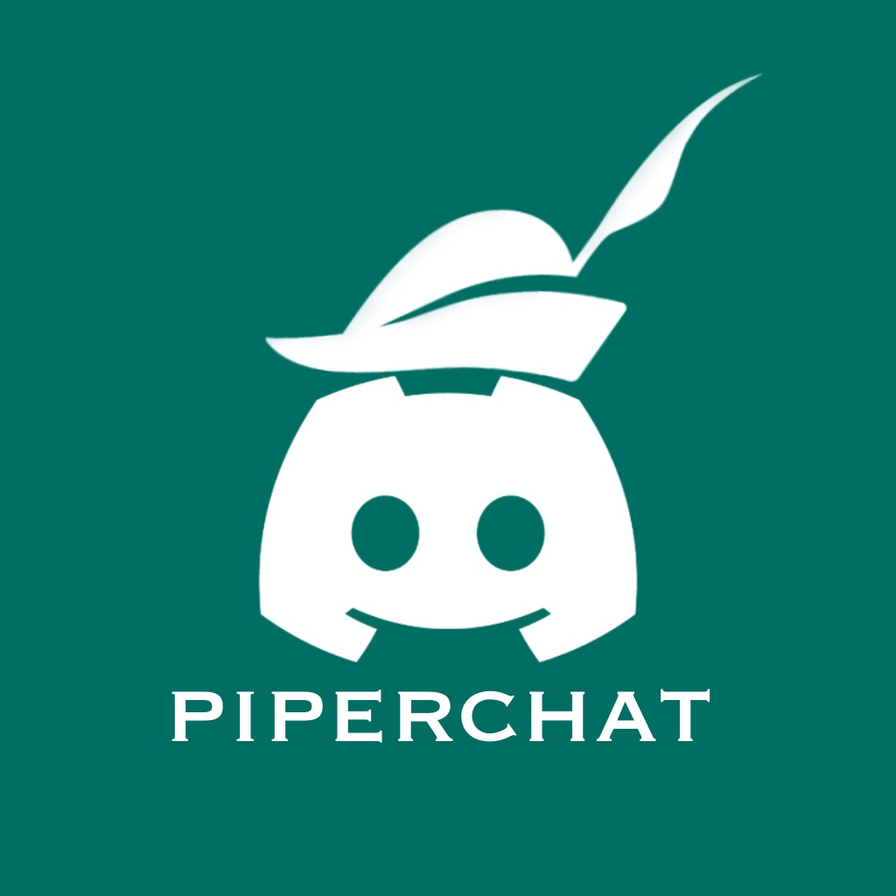

[![Contributors][contributors-shield]][contributors-url]
[![Forks][forks-shield]][forks-url]
[![Stargazers][stars-shield]][stars-url]
[![Issues][issues-shield]][issues-url]
[![MIT License][license-shield]][license-url]

<!-- PROJECT LOGO -->
 

  

  <h3 align="center">Piperchat</h3>

  

    Piperchat
     
    <a href="https://github.com/zucchero-sintattico/piperchat"><strong>Explore the docs »</strong></a>
     
     
  

<!-- TABLE OF CONTENTS -->

## Table of Contents

- [About the Project](#about-the-project)
  - [Built With](#built-with)
- [Getting Started](#getting-started)
  - [Prerequisites](#prerequisites)
  - [Installation](#installation)
- [Usage](#usage)
- [Roadmap](#roadmap)
- [Contributing](#contributing)
- [License](#license)
- [Contact](#contact)
- [Acknowledgements](#acknowledgements)

<!-- ABOUT THE PROJECT -->

## About The Project

### Built With

- [Node.js](https://nodejs.org/en/)

  - [TypeScript](https://www.typescriptlang.org/)
  - [Express](https://expressjs.com/)
  - [Socket.io](https://socket.io/)
  - [Mongoose](https://mongoosejs.com/)
  - [Amqplib](https://www.npmjs.com/package/amqplib)
  - [Vue.js](https://vuejs.org/)

- [MongoDB](https://www.mongodb.com/)
- [RabbitMQ](https://www.rabbitmq.com/)

<!-- GETTING STARTED -->

## Getting Started

To get a local copy up and running follow these simple steps.

### Prerequisites

TODO

### Installation

TODO

<!-- ROADMAP -->

## Roadmap

TODO

<!-- CONTRIBUTING -->

## Contributing

Contributions are what make the open source community such an amazing place to be learn, inspire, and create. Any contributions you make are **greatly appreciated**.

1. Fork the Project
2. Create your Feature Branch (`git checkout -b feature-amazing-feature`)
3. Commit your Changes (`git commit -m 'Add some Amazing Feature'`)
4. Push to the Branch (`git push origin feature-amazing-feature`)
5. Open a Pull Request

<!-- LICENSE -->

## License

Distributed under the MIT License. See [LICENSE](https://github.com/zucchero-sintattico/piperchat/blob/main/LICENSE) for more information.

<!-- CONTACT -->

## Contact

Project Link: [https://github.com/zucchero-sintattico/piperchat](https://github.com/zucchero-sintattico/piperchat)

<!-- ACKNOWLEDGEMENTS -->

## Acknowledgements

- [Alessandro Mazzoli](https://www.linkedin.com/in/alessandro-mazzoli-009868140/)
- [Manuel Andruccioli](https://www.linkedin.com/in/manuel-andruccioli-9259a5189/)
- [Luigi Borriello](https://www.linkedin.com/in/luigi-borriello/)
- [Tommaso Patriti](https://www.linkedin.com/in/tommaso-patriti/)

<!-- MARKDOWN LINKS & IMAGES -->
<!-- https://www.markdownguide.org/basic-syntax/#reference-style-links -->

[contributors-shield]: https://img.shields.io/github/contributors/zucchero-sintattico/piperchat.svg?style=flat-square
[contributors-url]: https://github.com/zucchero-sintattico/piperchat/graphs/contributors
[forks-shield]: https://img.shields.io/github/forks/zucchero-sintattico/piperchat.svg?style=flat-square
[forks-url]: https://github.com/zucchero-sintattico/piperchat/network/members
[stars-shield]: https://img.shields.io/github/stars/zucchero-sintattico/piperchat.svg?style=flat-square
[stars-url]: https://github.com/zucchero-sintattico/piperchat/stargazers
[issues-shield]: https://img.shields.io/github/issues/zucchero-sintattico/piperchat.svg?style=flat-square
[issues-url]: https://github.com/zucchero-sintattico/piperchat/issues
[license-shield]: https://img.shields.io/github/license/zucchero-sintattico/piperchat.svg?style=flat-square
[license-url]: https://github.com/zucchero-sintattico/piperchat/blob/master/LICENSE.txt
[product-screenshot]: images/screenshot.png
